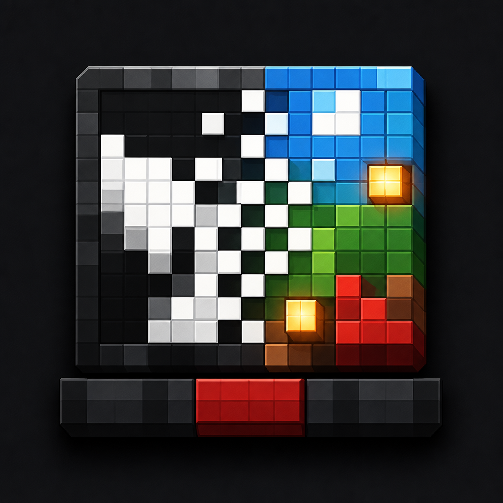

<div align="center">



# CusionBadApple

</div>

Converts a video into a Minecraft datapack that drives a redstone-lamp screen at
20 frames per second (one frame per game tick).

[简体中文](README.zh_CN.md)

## Web app

The primary interface runs fully in the browser with Vite, Vue 3, Arco Design,
and FFmpeg WebAssembly. Video files are never uploaded.

```powershell
pnpm install
pnpm web:dev
```

Build and preview the production site:

```powershell
pnpm web:build
pnpm web:preview
```

The app includes English/Chinese localization, light/dark themes, calibrated
CIEDE2000 color matching, ordered dithering, macro plus UUID rendering, progress
reporting, and ZIP download. It defaults to a five-second clip because a full
video can require several GiB of browser memory.

## Generate

Install dependencies, put exactly one video in `input/`, then run:

```powershell
pnpm install
pnpm start -- --mode binary
```

The CLI also uses `@ffmpeg/core` WebAssembly. It does not require a system
FFmpeg installation or the `ffmpeg-static` package.

Floyd-Steinberg dithering is also available:

```powershell
pnpm start -- --mode dither
```

RGBW 2x2 subpixels support nearest-color matching and color error diffusion:

```powershell
pnpm start -- --mode rgbw-nearest
pnpm start -- --mode rgbw-dither
```

Use `--input` and `--output` to select an explicit source and a separate datapack:

```powershell
pnpm start -- --input "input/video.mp4" --output datapack-rgb --mode rgbw-dither
```

Generate only a time range with `--start` (inclusive) and `--end` (exclusive):

```powershell
pnpm start -- --input "input/video.mp4" --output datapack-clip --mode color-nearest --start 0 --end 5
```

Prototype the storage/function-macro renderer for a color clip:

```powershell
pnpm start -- --input "input/video.mp4" --output datapack-macro-clip --mode color-nearest --macro-storage --start 0 --end 5
```

Generate cushions with deterministic UUIDs and update changed colors directly by UUID:

```powershell
pnpm start -- --input "input/video.mp4" --output datapack-uuid-clip --mode color-nearest --uuid-entities --start 0 --end 5
```

Direct 16-color cushion rendering is available without RGBW subpixels:

```powershell
pnpm start -- --input "input/video.mp4" --output datapack-rgb --mode color-nearest
pnpm start -- --input "input/video.mp4" --output datapack-rgb --mode color-dither
pnpm start -- --input "input/video.mp4" --output datapack-rgb --mode color-ordered
```

`color-ordered` uses a 4x4 Bayer matrix. Color modes match against all 192
measured color/brightness states from the calibration screenshot using
CIEDE2000. A color pixel is emitted only when its CIEDE2000 distance from the
last state actually written to Minecraft is greater than 10. Smaller changes
remain pending against that displayed state, so accumulated changes can still
cross the threshold. Combine storage macros with fixed UUID targeting when desired:

```powershell
pnpm start -- --input "input/video.mp4" --output datapack-macro-uuid --mode color-ordered --macro-uuid
```

These modes use one cushion per video pixel at the full screen resolution. The
zero-brightness support blocks are stone instead of redstone lamps. Frames update only changed
cushions with `data modify entity @s color`, using all 16 dye color values.
The support block also changes independently to represent light levels
0, 3, 4, 6, 7, 8, 9, 10, 11, 12, 13, and 15.

In RGBW modes, a 128 by 96 block screen represents a 64 by 48 pixel video. Each
logical pixel uses this fixed cushion layout:

```text
R G
B W
```

The generated cushion entities use `color:"red"`, `color:"green"`,
`color:"blue"`, and `color:"white"` NBT values. Redstone blocks independently
switch each subpixel on and off. White is represented only by the white
subpixel; neutral grayscale pixels are dithered exclusively between white and
off. RGB subpixels are reserved for saturated primary and secondary colors.

The default screen is 128 by 96 blocks. Run `pnpm start -- --help` for threshold,
size, inversion, explicit input path, and test-frame options. The converter keeps
the source aspect ratio and pads unused screen space with black.

## Use in Minecraft

Copy/install the generated `datapack/` in a world, then run these functions:

```mcfunction
/function gugle:setup
/function gugle:start
/function gugle:restart
/function gugle:pause
/function gugle:resume
/function gugle:stop
/function gugle:status
/function gugle:remove
/function gugle:palette
```

`start` is idempotent while the video is playing, so repeated button or command
block triggers do not jump back to frame zero. Use `restart` when an intentional
restart is needed. `status` prints the current frame, playing state, and restart
count.

`setup` builds one screen row per tick so large screens do not exceed the command
sequence limit. Calling `start` before setup finishes queues playback; it starts
automatically after the final row is ready.

Run `setup` at the lower north-west corner of the screen. The screen occupies
positive X and positive Z, with redstone blocks at Y+1 and lamps at Y+2.

Frame functions contain only pixels that changed since the previous frame.
Adjacent changes are combined into two-dimensional `fill` rectangles to reduce
command count. `setup` also raises `max_command_forks` and
`max_command_sequence_length` so busy frames cannot cut off the next scheduled
tick.

`palette` creates a 12-column by 16-row calibration grid at the command
execution position. Columns use the configured brightness tiers from 0 through
15; rows use the 16 cushion dye colors in the order shown by the command output.
It removes only the previous palette support blocks and palette-tagged cushions.
