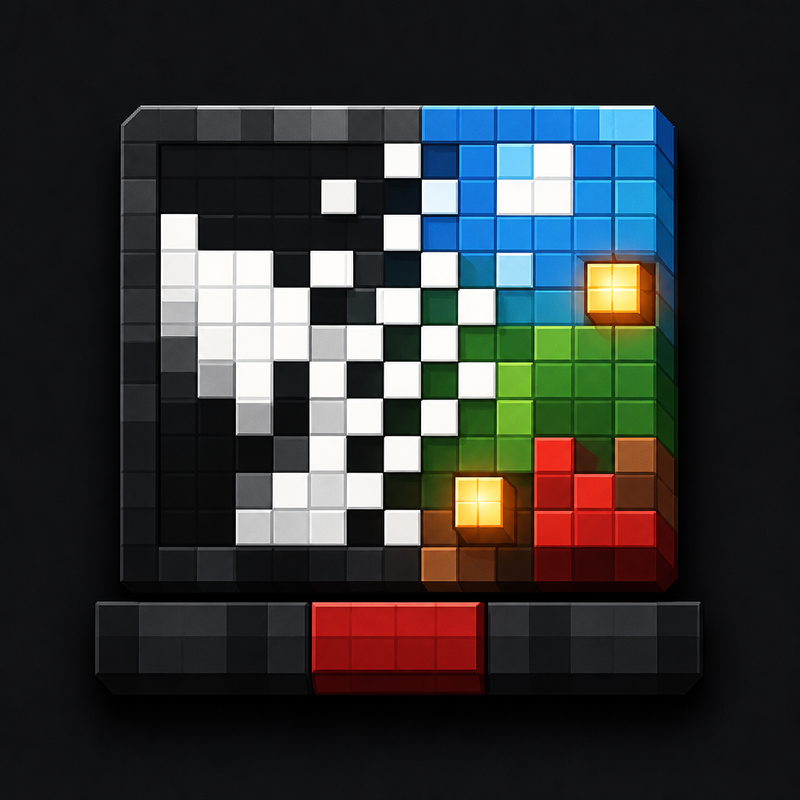

<div align="center">



# CusionBadApple

</div>

在浏览器中把视频转换成 Minecraft 坐垫屏幕数据包。视频解码使用 FFmpeg WebAssembly，文件不会上传到服务器。

[English](README.md)

## Web 端

```powershell
pnpm install
pnpm web:dev
```

打开终端显示的本地地址，选择视频并生成 ZIP。生产构建：

```powershell
pnpm web:build
pnpm web:preview
```

网页使用 Vite、Vue 3 和 Arco Design，支持：

- 中文和英文即时切换
- 浅色、深色主题切换
- FFmpeg WASM 本地视频解码
- 20 FPS，每 tick 一帧
- CIEDE2000 校色及 192 状态实测色板
- Floyd-Steinberg 和 4×4 Bayer 有序抖动
- `ΔE00 > 10` 脏像素过滤
- storage 宏、固定 UUID 和宏 + UUID 模式
- 浏览器内生成并下载 datapack ZIP

默认结束时间为 5 秒。浏览器会同时保存源视频、原始帧、函数文本和 ZIP，完整视频可能消耗数 GiB 内存，建议先用短片段检查效果。

## 命令行

CLI 同样使用 `@ffmpeg/core` WebAssembly，不依赖系统 FFmpeg 或 `ffmpeg-static`：

```powershell
pnpm start -- --input "input/video.mp4" --output datapack-output --mode color-ordered --macro-uuid --start 0 --end 5
```

闀胯棰戝彲浠ュ惎鐢ㄧ揣鍑?UUID 瀹忥紝姣忎釜鍙樺寲鍍忕礌鍙繚瀛?8 浣?UUID 鍚庣紑鍜岀姸鎬侊紝浠ュ噺灏戝抚鍑芥暟鍜屾暟鎹寘浣撶Н锛?

```powershell
pnpm start -- --input "input/video.mp4" --output datapack-compact --mode color-ordered --macro-uuid --compact-uuid-macro
```

`pnpm start --` 中，`pnpm start` 运行 `package.json` 的 `start` 脚本，末尾 `--` 把后面的参数传给生成器。

主要模式：

```text
binary          黑白二值
dither          黑白 Floyd-Steinberg 抖动
ordered         黑白 4×4 Bayer 有序抖动
rgbw-nearest    2×2 红绿蓝白子像素
rgbw-dither     RGBW 误差扩散
rgb-nearest     3×3 RGB 三级亮度最近组合
rgb-dither      3×3 RGB 三级亮度误差扩散
color-nearest   CIEDE2000 最近状态
color-dither    彩色 Floyd-Steinberg 抖动
color-ordered   彩色 4×4 Bayer 有序抖动
color-blue-noise        彩色固定蓝噪声抖动
color-pair-blue-noise   彩色双状态蓝噪声混色
color-serpentine        彩色蛇形 Floyd-Steinberg 抖动
color-sierra-lite       彩色蛇形 Sierra Lite 抖动
```

`color-ordered` 可使用 `--ordered-amplitude <数值>` 调整每个 Bayer 等级的 RGB
偏移量，默认值为 `10`；设为 `0` 时关闭有序噪声。

网页和命令行输入的是视频逻辑分辨率。RGBW 模式会将输入宽高自动乘 `2`，
RGB 3×3 模式会自动乘 `3`。例如输入 `43×32` 时，RGB 3×3 模式生成
`129×96` 方块的屏幕。每个逻辑像素使用以下固定排列：

```text
R0 G2 B1
G1 B0 R2
B2 R1 G0
```

编号 `0` 使用亮度 15 的点亮铜灯，`1` 使用亮度 12 的点亮斑驳铜灯，`2`
使用亮度 8 的点亮锈蚀铜灯；关闭的子像素使用石头。`rgb-nearest` 为每个
RGB 通道选择最接近的三灯组合，`rgb-dither` 还会把剩余 RGB 误差扩散到
相邻逻辑像素。

## Minecraft 使用

把 ZIP 解压到世界的 `datapacks` 目录，然后执行：

```mcfunction
/reload
/function gugle:setup
/function gugle:start
```

其他函数：

```mcfunction
/function gugle:restart
/function gugle:pause
/function gugle:resume
/function gugle:stop
/function gugle:status
/function gugle:remove
/function gugle:palette
```

`palette` 在执行位置生成 12 列亮度 × 16 行颜色的校准色板。

## GitHub Pages

[pages.yml](.github/workflows/pages.yml) 会在推送到 `master` 或手动触发时执行检查、构建 Web 端并部署到 GitHub Pages。首次使用时，在仓库 Settings → Pages 中把 Source 设置为 **GitHub Actions**。

仓库默认部署路径为：

```text
https://gu-zt.github.io/CusionBadApple/
```

## 校验

```powershell
pnpm run check
pnpm web:build
```
